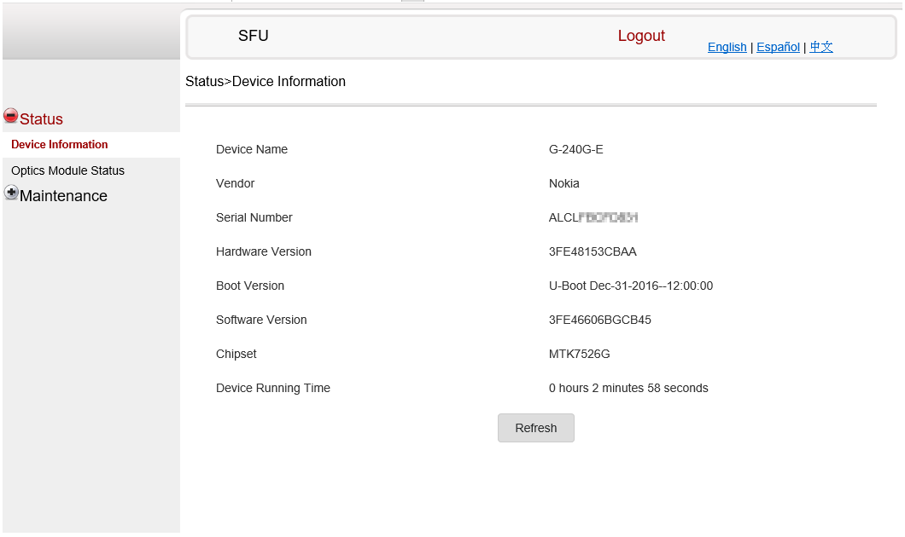
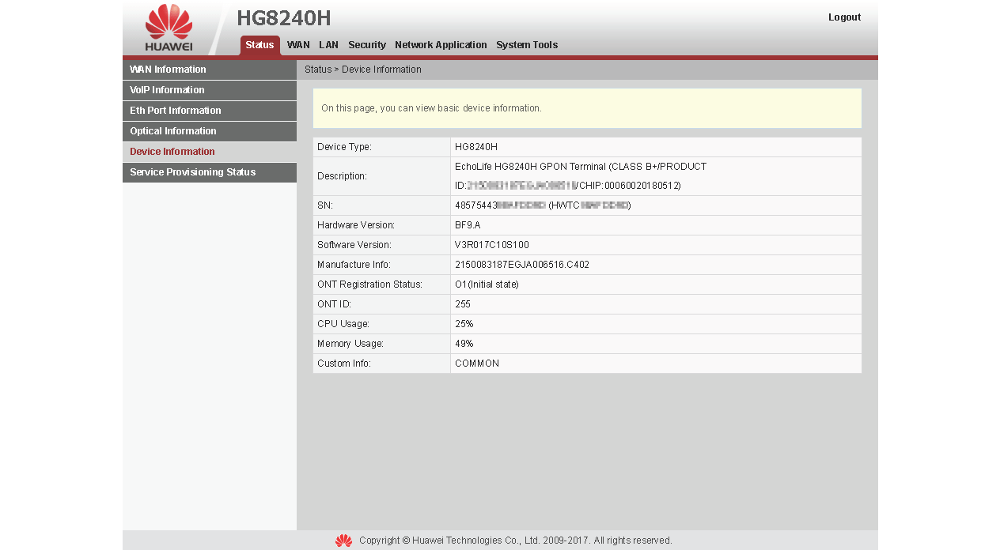
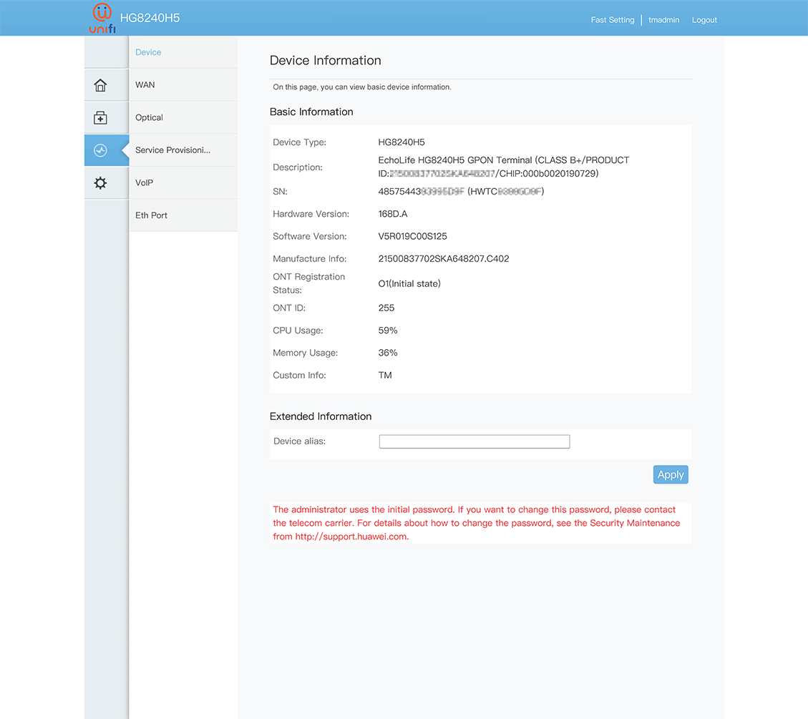

# Setup
In this guide, how to setup your **SFP XPON ONU Stick** based on your existing ONU and get Authenticated!

# Know your fiber
* Some fiber vendor provide **"Universal** 1-port or 4-port or All in One ONU
* Some fiber limit **"verified"** ONU
* Some fiber doesn't care `PLOAM Password` or `MAC Address` or both
* Your `PLOAM Password`
* Your `MAC Address`

# Prepair Information
You need to login into your old ONU, most ONU will have information page where you can get:
| Information | Flash Set Value |
|-------------|-----------------|
| MAC Address | `ELAN_MAC_ADDR` <sub><sup>V2801F</sup></sub> |
| Hardware Version | `HW_HWVER` <sub><sup>V2801F</sup></sub> |
| Software Version | `OMCI_SW_VER1`, `OMCI_SW_VER2`, `CUSTOM_OMCI_SW_VER1`, `CUSTOM_OMCI_SW_VER2` |
| Serial Number | `GPON_SN` |
| Manufacture Info | `PON_VENDOR_ID` |
| Device Model | `GPON_ONU_MODEL` |

# V2801F
When changing `ELAN_MAC_ADDR` and/or `HW_HWVER`, you are required to update `VS_AUTH_KEY` by using `VsAuthKeyGen.exe` in command prompt.

## Syntax:
```
VsAuthKeyGen.exe <mac_address> [HW_HWVER]
```

### Example
Open a Command Prompt where `VsAuthKeyGen.exe` is reside, example:
```
VsAuthKeyGen.exe 000000111111 168D.A
```

Return value look like this:
```
9E7E54597511D721D3A2932B048C0494
```

Copy and update `VS_AUTH_KEY` in telnet:
```
flash set VS_AUTH_KEY 9E7E54597511D721D3A2932B048C0494
```

# ONU
## G-240G-E


## HG8240H


## HG8240H5



# Update Stick
Every `flash set` require `reboot` to take effect

## Basic
Both are most important, try `set` these if works.

### MAC Address
```
flash set ELAN_MAC_ADDR 000000111111
```
> Note to V2801F users:<br/>
> Require generate new `VS_AUTH_KEY`, run `VsAuthKeyGen.exe` in Command Prompt like this `VsAuthKeyGen 000000111111`

### ONU Serial Number
Required to get authenticated, OLT may block rouge ONU in the network. Setting this require to update Vendor ID `PON_VENDOR_ID`
```
flash set GPON_SN HWTC00000000
```

### PLOAM Password
* Only accept **ASCII** Character.
* If your password is `DEFAULT` or **bunch of zero** or **blank**, that mean you are using LOID Authentication
```
flash set GPON_PLOAM_PASSWD DEFAULT012
```

### LOID & LOID Password
* May only need `LOID` or `LOID` & `Password`
```
flash set LOID 0123456789
flash set LOID_PASSWD 0123456789
```

> Depen on fiber vendor either using **PLOAM** or **LOID** but not both

## OMCI Authentication
If **basic** setup still don't have access or pppoe not working, highly chance that your OLT need additional device information

### ONU Model
OLT might require which model are in whitelist (verified)
```
flash set GPON_ONU_MODEL HG8240H5
```

### ONU Vendor
OLT need to know which Manufacturer are in whitelist. Some known Vendor ID:
|   ID   | Vendor Name |
|--------|-------------|
| `HWTC` | Huawei      |
| `ZTEG` | ZTE         |
| `ALCL` | Nokia/Alcatel-Lucent |
| `UBNT` | Ubiquiti    |
| `FHTT` | Fiber Home  |
| `RTKG` | Realtek     |
```
flash set PON_VENDOR_ID HWTC
```
> Vendor ID must match with Serial Number

### ONU Software Version
OLT need to know which software version.
```
flash set OMCI_SW_VER1 V5R019C00S125
flash set OMCI_SW_VER2 V5R019C00S125
flash set CUSTOM_OMCI_SW_VER1 V5R019C00S125
flash set CUSTOM_OMCI_SW_VER2 V5R019C00S125
```
> In normal ONU Box:<br/>
> Firmware get's updated when version is out of date. This has no effect with **SFP XPON ONU Stick**

### Hardware Version
In some rare case, OLT need to know which hardware are you using
```
flash set HW_HWVER 168D.A
```
> Note to V2801F users:<br/>
> Require generate new `VS_AUTH_KEY`, run `VsAuthKeyGen.exe` in Command Prompt like this `VsAuthKeyGen 000000111111 168D.A`

### OMCI Fake `OK`
Sometime **SFP XPON ONU Stick** doesn't understand what OLT is sending, setting this let **SFP XPON ONU Stick** reply `OK`
```
flash set OMCI_FAKE_OK 1
```

### OMCI OLT Mode
Make **SFP XPON ONU Stick** universal, some OLT have special OMCI, most common OMCI is Huawei, for example, making **SFP XPON ONU Stick** act like Huawei ONU and understand Huawei OMCI and compatible with Huawei OLT.

Even Nokia OLT, Huawei is most common due to "Universal ONU" deployment.

#### Default
```
flash set OMCI_OLT_MODE 0
```
#### Huawei
```
flash set OMCI_OLT_MODE 1
```
#### ZTE
```
flash set OMCI_OLT_MODE 2
```

## CWMP
TR069. You can skip this if you have internet access, this may not required in most cases, some very strict OLT need

```
flash set HW_CWMP_MANUFACTURER 'Huawei Technologies Co., Ltd'
flash set HW_CWMP_PRODUCTCLASS HG8240H5
```

## Summary
```
flash set GPON_PLOAM_PASSWD 0123456789
flash set GPON_SN ALCL00000000

flash set GPON_ONU_MODEL G-240G-E
flash set PON_VENDOR_ID ALCL
flash set OMCI_SW_VER1 3FE46606BGCB45
flash set OMCI_SW_VER2 3FE46606BGCB45
flash set CUSTOM_OMCI_SW_VER1 3FE46606BGCB45
flash set CUSTOM_OMCI_SW_VER2 3FE46606BGCB45

flash set HW_HWVER 3FE48153CBAA
flash set ELAN_MAC_ADDR 781735000000
flash set VS_AUTH_KEY EF0FC1A970A27D52DF340835F0561507

flash set OMCI_FAKE_OK 1
flash set OMCI_OLT_MODE 1
```

# `O5` No Internet
Your stick get `O5` status mean it was registed on the fiber network, most user have internet access, however some OLT doesn't permit your traffic due to wrong OMCI.

If your original ONU doesnt give any **"Device Information"** page, try buy different cheap ONU box like Huawei HG8240H, if that ONU can give internet, copy that ONU info!

My fiber vendor ([TM](https://unifi.com.my/)) and my ISP ([Maxis](https://www.maxis.com.my/)) doesn't care MAC Address, only PLOAM Password and Full OMCI Information, it may different, for the best option update everything.

# Original
You may need to write down your original value:
```
flash get PON_VENDOR_ID
flash get HW_CWMP_MANUFACTURER
flash get HW_CWMP_PRODUCTCLASS
flash get HW_HWVER
flash get OMCI_VEIP_SLOT_ID
flash get OMCI_OLT_MODE
flash get OMCI_FAKE_OK
flash get OMCI_SW_VER1
flash get OMCI_SW_VER2
flash get GPON_ONU_MODEL
flash get GPON_SN
flash get GPON_PLOAM_PASSWD
flash get ELAN_MAC_ADDR
```
