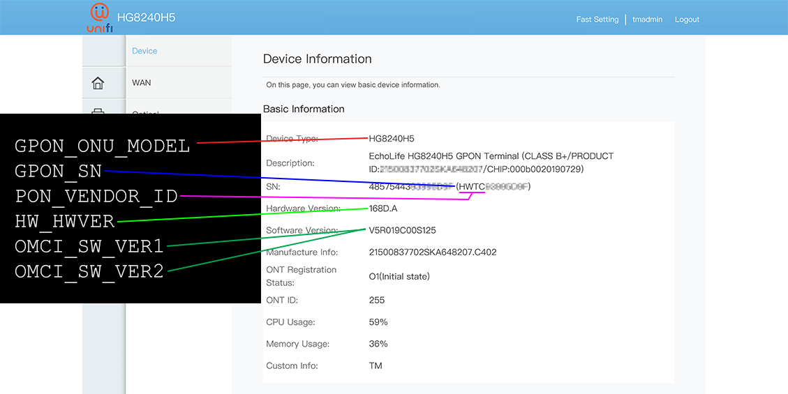

# Stock ONU
here list known ONU device for OMCI Info Cloning, making your xPON ONU SFP Stick act like your original ONU to fool Fiber Vendor OLT

## Telnet `flash set`

```
flash set GPON_ONU_MODEL 
flash set GPON_SN 
flash set PON_VENDOR_ID 
flash set HW_HWVER 
flash set OMCI_SW_VER1 
flash set OMCI_SW_VER2 
```
Use value from table below

# OMCI Info
| `GPON_ONU_MODEL` | `GPON_SN`    |`PON_VENDOR_ID` | `HW_HWVER`      | `OMCI_SW_VER#`   | Owner     | ISP |
|------------------|--------------|----------------|-----------------|------------------|-----------|-----|
| EG8010Hv6        | HWTC12345678 | HWTC           | 260F.A          | V5R020C10S035    | lwk523    | [Allo](https://www.allo.my/city-broadband/) |
| HG8240H          | HWTC12345678 | HWTC           | BF9.A           | V3R017C10S100    | hezaika   | [TIME](https://www.time.com.my/personal/broadband/fibre-broadband) |
| HG8240H5         | HWTC12345678 | HWTC           | 168D.A          | V5R019C00S125    | anime4000 | [TM](https://www.unifi.com.my/) |
| HG8145V5         | HWTC12345678 | HWTC           | 15AD.A          | V5R020C00S060    | hezaika   | [TIME](https://www.time.com.my/personal/broadband/fibre-broadband) |
| G-240G-E         | ALCL12345678 | ALCL           | 3FE48153CBAA    | 3FE46606BGCB45   | anime4000 | [TM](https://www.unifi.com.my/) |
| HG6240A          | FHTT12345678 | FHTT           | WKE2.094.325A01 | RP2775           | lwk523    | [TM](https://www.unifi.com.my/) |
| RTF8207W         | ASKY12345678 | ASKY           | RTF8207W        | R8207WR210601    | pccr10001 | [Hinet](https://broadband.hinet.net/Broadband/internetManagement/internet/internet/internet_02.do) |
| RTF8217          | DSNW12345678 | ASKY           | RTF8217         | R8217R211219     | akw28888 | [Hinet](https://broadband.hinet.net/Broadband/internetManagement/internet/internet/internet_02.do) |
| I-040GW          | GTHG12345678 | GTHG           | 3FE99997HGW001  | I040GWR200110    | akw28888 | [Hinet](https://broadband.hinet.net/Broadband/internetManagement/internet/internet/internet_02.do) |
| I040GB           | GMTK12345678 | GMTK           | 3FE99995AAAA01  | I040GBN131231    | akw28888 | [Hinet](https://broadband.hinet.net/Broadband/internetManagement/internet/internet/internet_02.do) |
| H660WM           | DSNW12345678 | DSNW           | H660WM          | H660WMR210825    | akw28888 | [Hinet](https://broadband.hinet.net/Broadband/internetManagement/internet/internet/internet_02.do) |
| RV6699           | SCOM12345678 | SCOM           | V4              | SC3.0.14         | skon77 | [MGTS](https://mgts.ru/) |
| RV6699           | SCOM12345678 | SCOM           | V4              | SC3.0.16         | skon77 | [MGTS](https://mgts.ru/) |
| PMG4506-T20B     | ZYXE12345678 | ZYXE           | PMG4506-T20B    | P4506R220425     | akw28888 | [Hinet](https://broadband.hinet.net/Broadband/internetManagement/internet/internet/internet_02.do) |
| G040WQ           | NOKW12345678 | GMTK           | 3FE47772AAAA    | G040WQR201207    | pccr10001 | [Hinet](https://broadband.hinet.net/Broadband/internetManagement/internet/internet/internet_02.do) |
| EDGG11000        | EDCR12345678 | EDCR           | GG-GAPL100v02   | GG-11000-C003    | Remooh    | [Vivo (Vivo 1/São Paulo region)](https://www.vivo.com.br/para-voce/produtos-e-servicos/para-casa/internet) |
