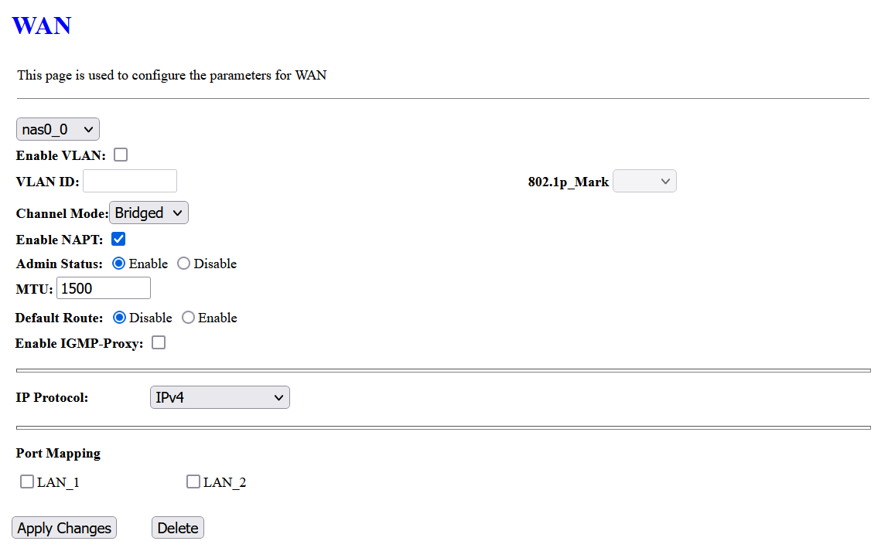

# Firmware Upgrade/Downgrade
```
http://192.168.1.1/upgrade.asp
```

# OMCI Info
It's recommend to update OMCI via telnet, [read here](Docs/Setup_Stick.md#omci-authentication)
```
http://192.168.1.1/omci_info.asp
```


# WAN Mapping
WAN Mapping feature is last attempt to when xPON Stick failed to bridge/no internet, currently I havent research `DFP-34X-2C2 (Realtek)` to work with my fiber, I not sure `DFP-34X-2C2 (Realtek)` is support 4-Port ONU Emulation, so I did not add into table above.
```
http://192.168.1.1/multi_wan_generic.asp
```


# Bridge Forwarding Database
```
http://192.168.1.1/fdbtbl.asp
```

> `-da` is `nas0_0`, `-d7` is `br0` & `eth0`
```
# brctl show
bridge name     bridge id               STP enabled     interfaces
br0             8000.000000deadd7       no              eth0
                                                        nas0_0
```
