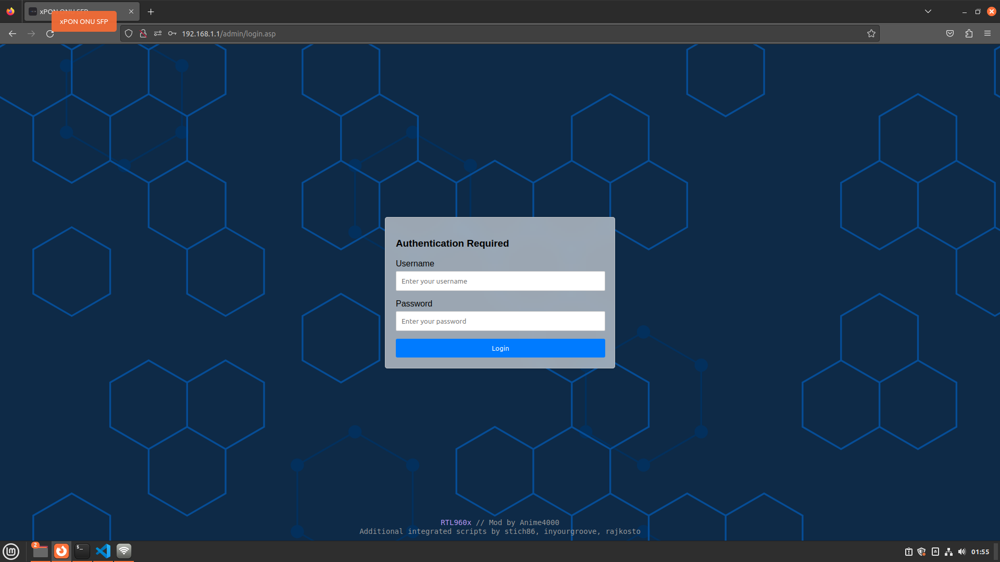
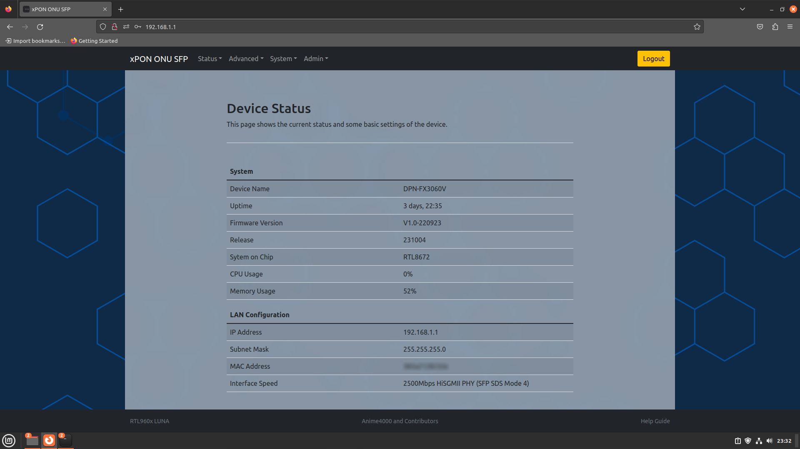
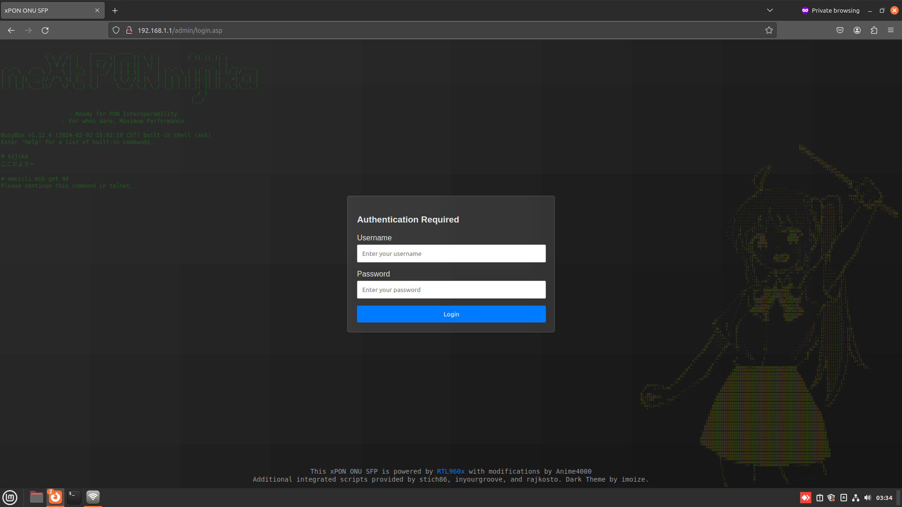
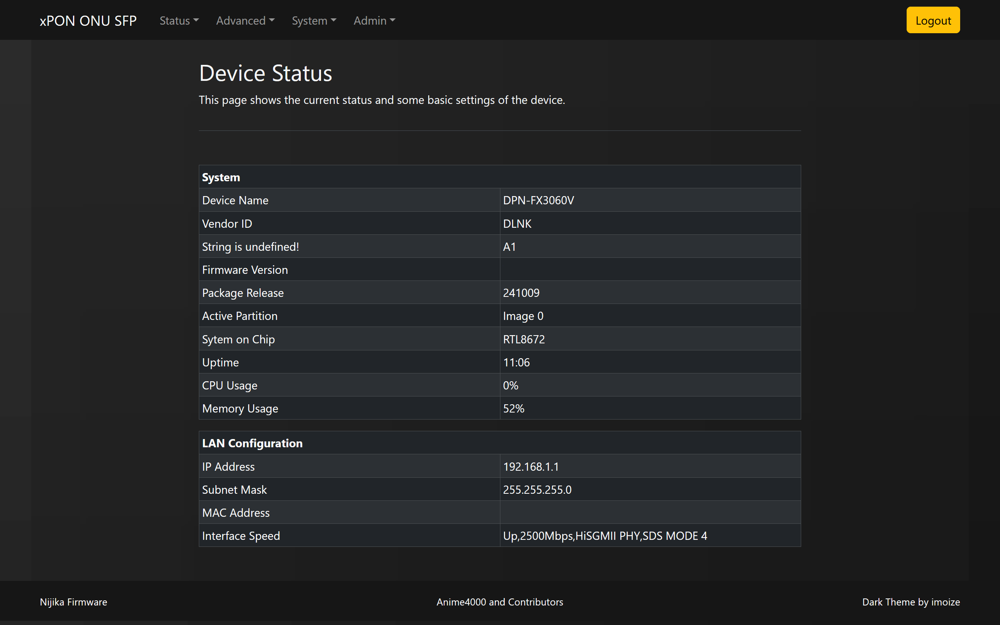

# Firmware Modding
This repository contains folders corresponding to different GPON ONU SFP modules of the root filesystem.

| Vendor   | Model       | SoC       | Interchangeable |
|----------|-------------|-----------|-----------------|
| ODI      | DFP-34X-2C2 | RTL9601D  | -               |
| TWC      | TWCGPON657  | RTL9601C1 | V2801F          |
| VSOL     | V2801F      | RTL9601C1 | TWCGPON657      |

## How to Mod
To mod the firmware:
1. Run `qemu-test.sh`.
2. Copy and paste the relevant code.
3. Exit `qemu-test.sh`. The firmware images will be rebuilt.

# How to send
To send a modded binary or file, you can use `nc` (netcat).

## GPON ONU SFP
Start the `nc` listening server on GPON ONU SFP:
```
nc -l -p 12345 > file
```

## Ubuntu PC
Send the file from your Ubuntu PC to GPON ONU SFP:
```
nc 192.168.1.1 12345 < file
```
> [!NOTE]
> `nc` on GPON ONU SFP will not exit once the transfer is complete. You need to use CTRL+C on GPON ONU SFP Telnet to complete the transfer.

# WebGUI
| Model       | Login Screen | Status |
|-------------|-----------------------------------------------|------------------------------------------------|
| V2801F      |      |      |
| DFP-34X-2C2 gui V2801F fork |  |  |
| DFP-34X-2C2 dark by [imoize](https://github.com/imoize) |  |  |

# WebGUI Improvement
## DFP-34X-2C2
To mitigate Fake O5, included additional information like ME 84 and 171 in the WebGUI for troubleshooting purposes. Additionally, implemented further Forward Operation hacks to enable bridging as needed.

### OLT Info


### Forward Operation


> [!NOTE]
> This are Work In Progress

# Contribution
We welcome contributions from everyone to enhance the firmware, making it more accessible and adhering to open standards (Universal).
