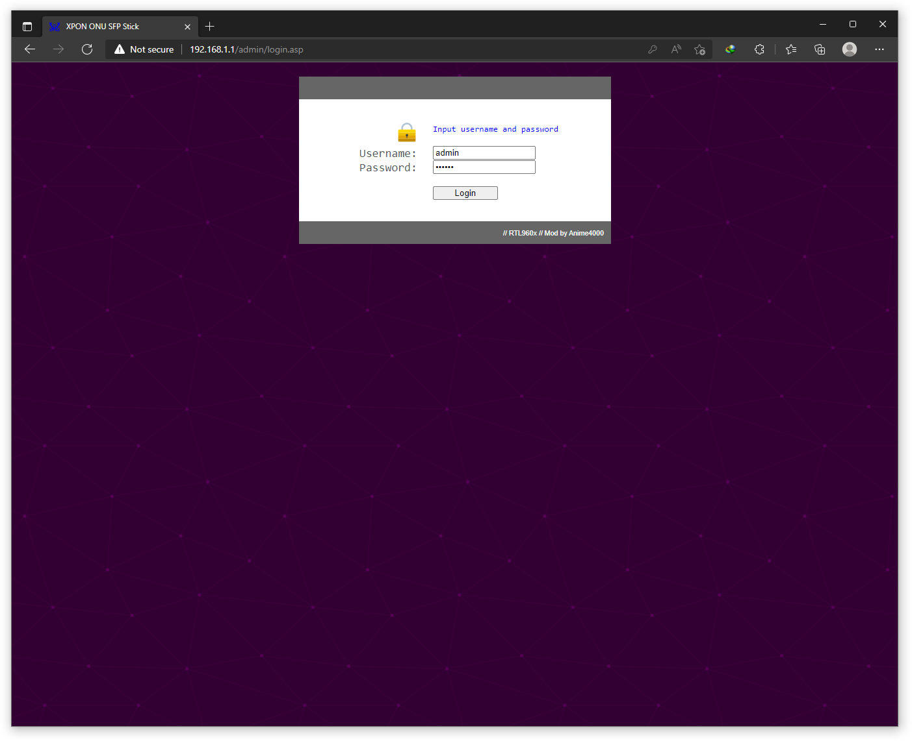
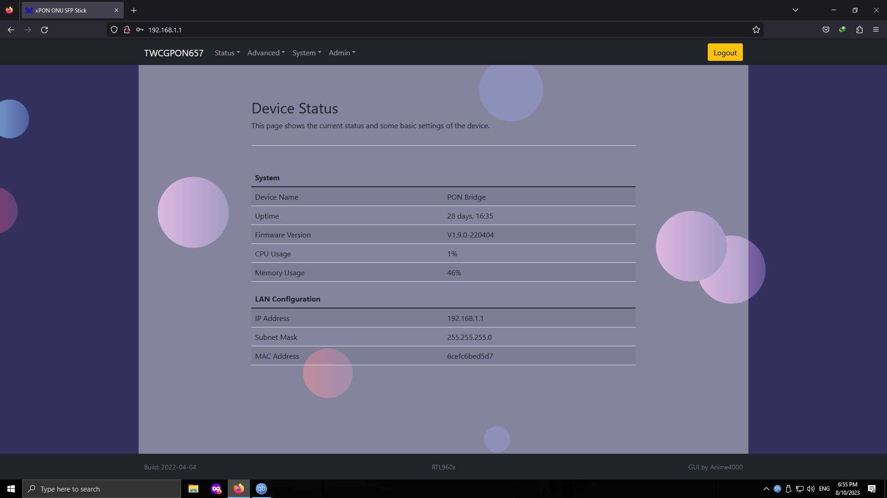
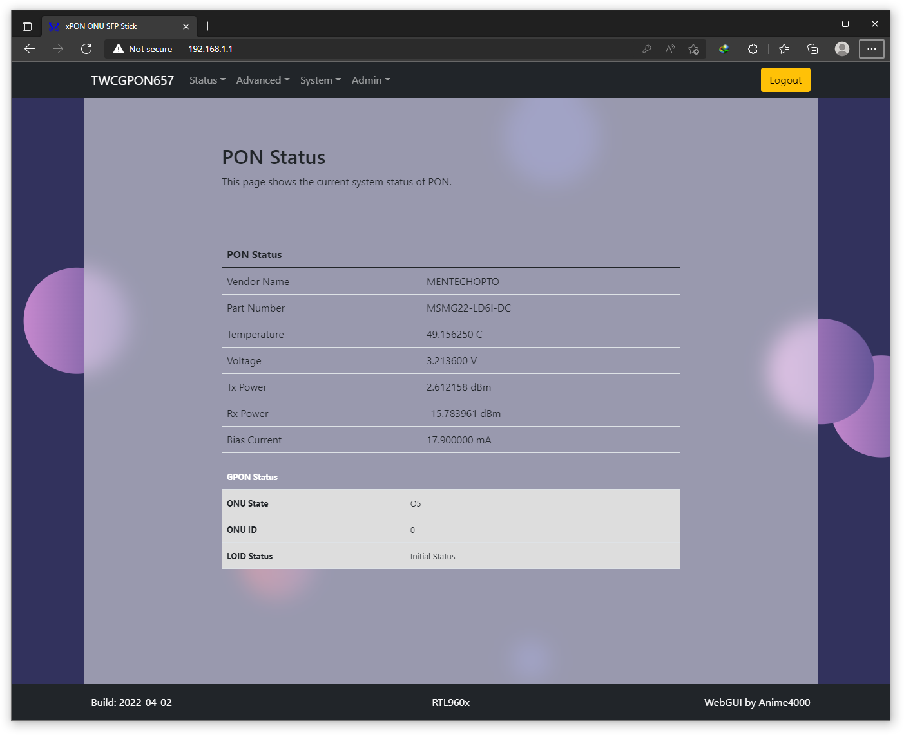
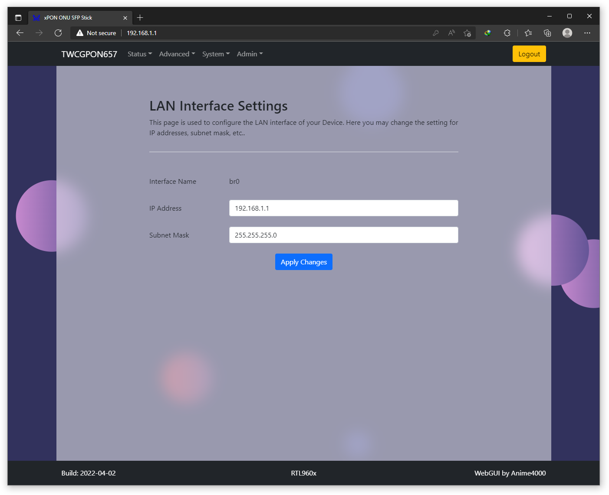
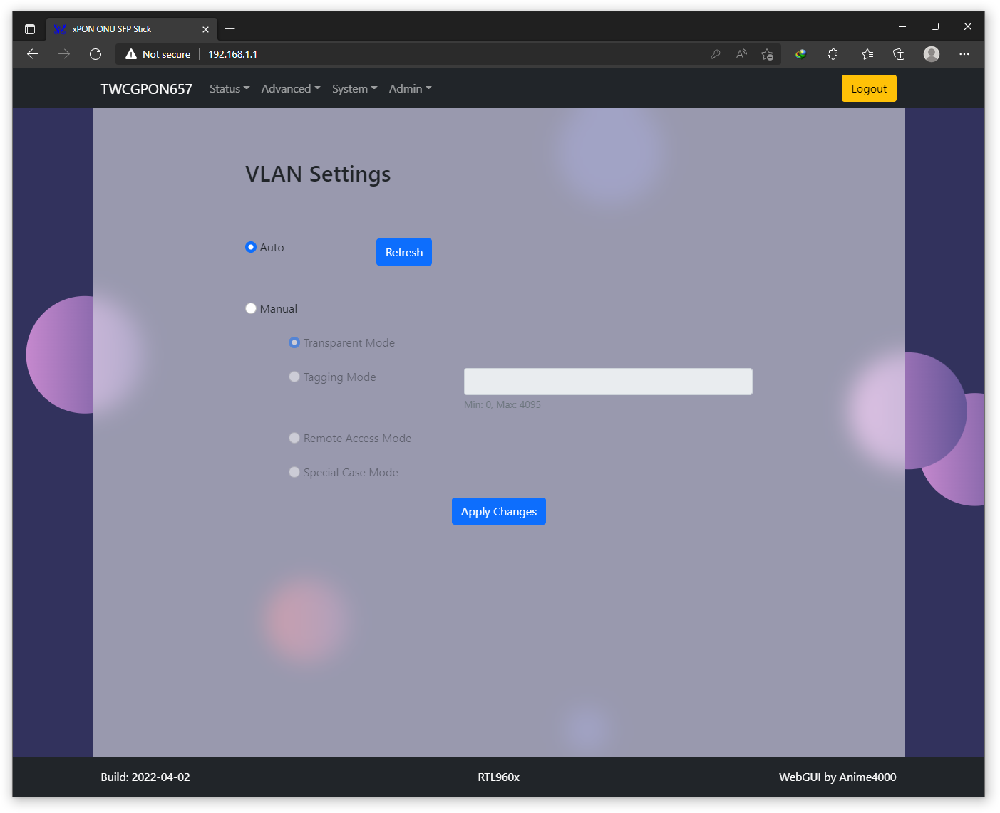
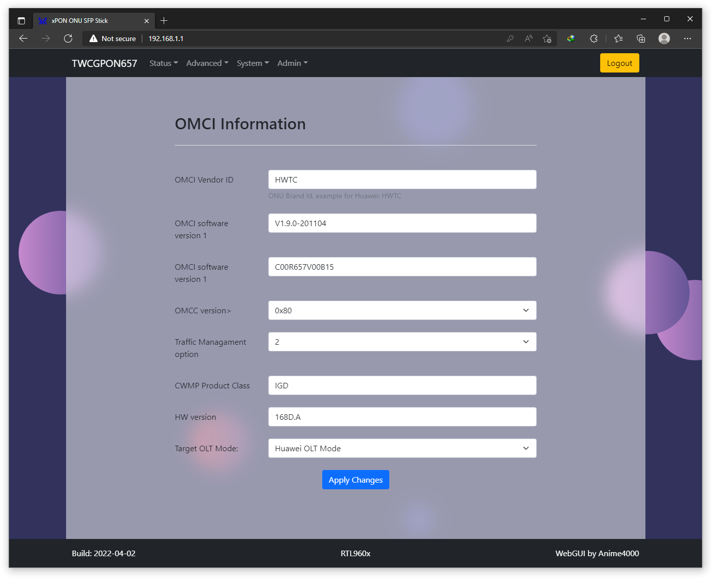
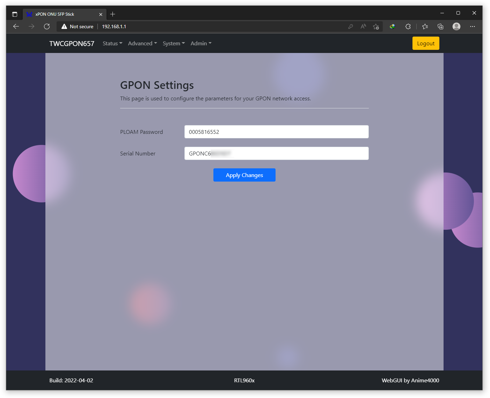
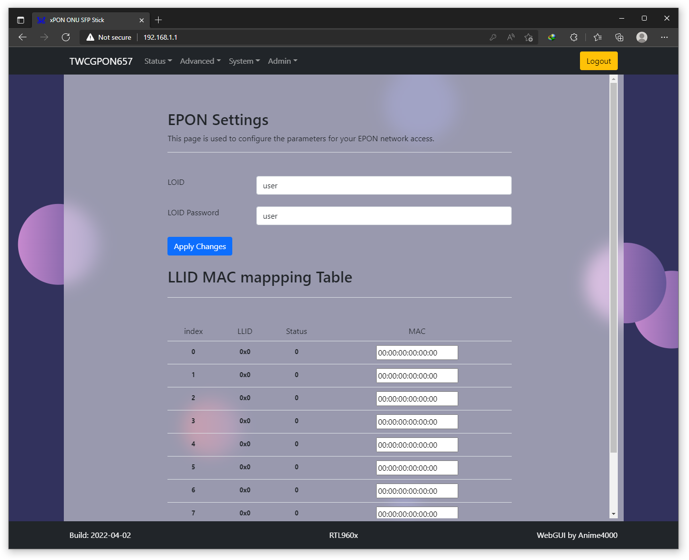
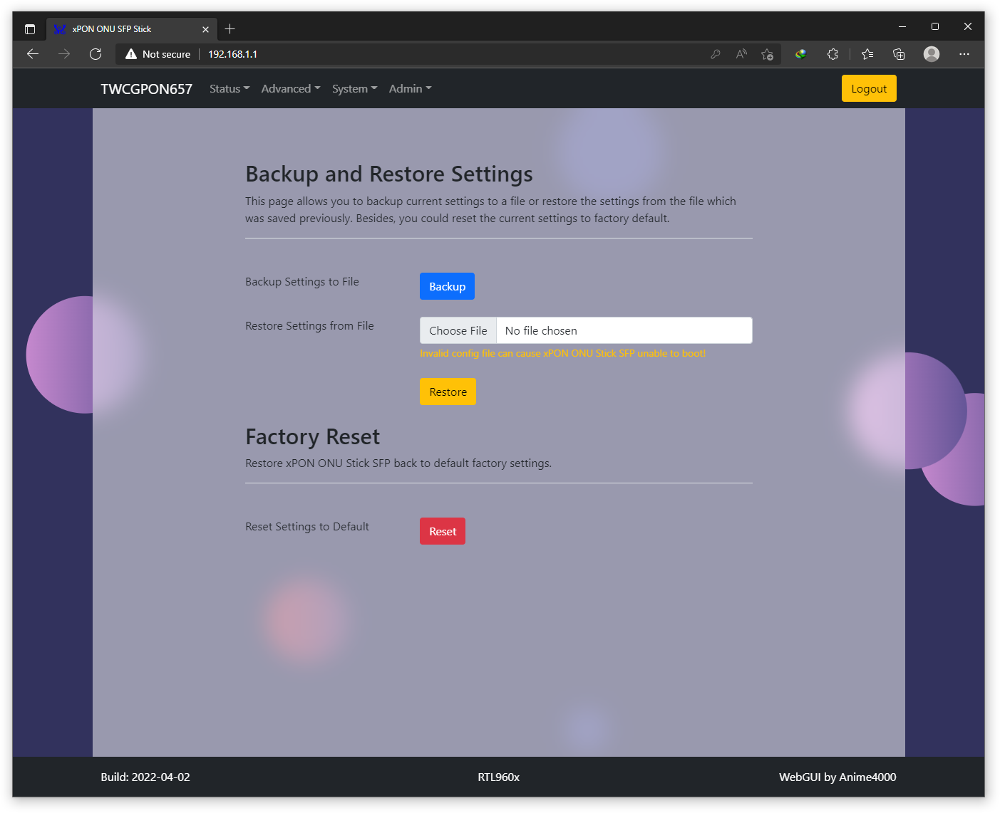
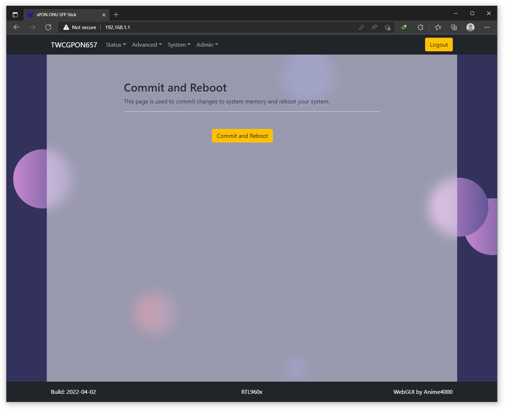

# Embeded WebGUI
porting from ancient HTML to modern HTML5!

* Bootstrap 5
* No jQuery! Pure JS
* SVG

# Example:

> There some not working javascript, display current setting might not work
